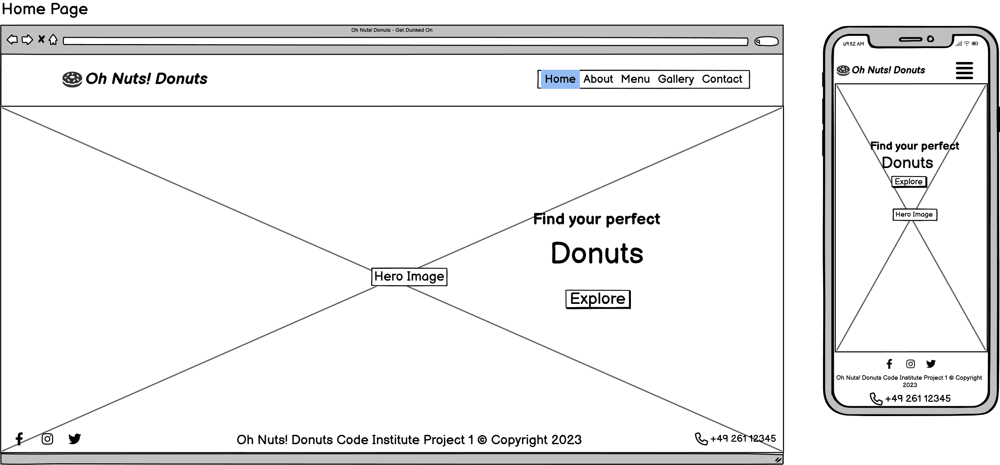
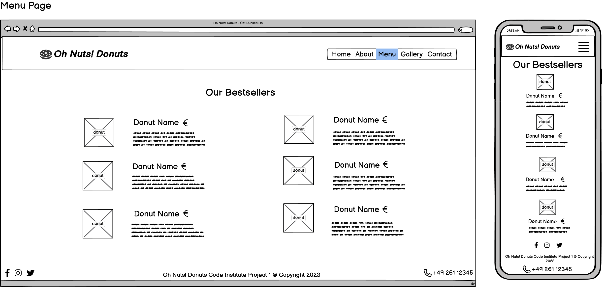
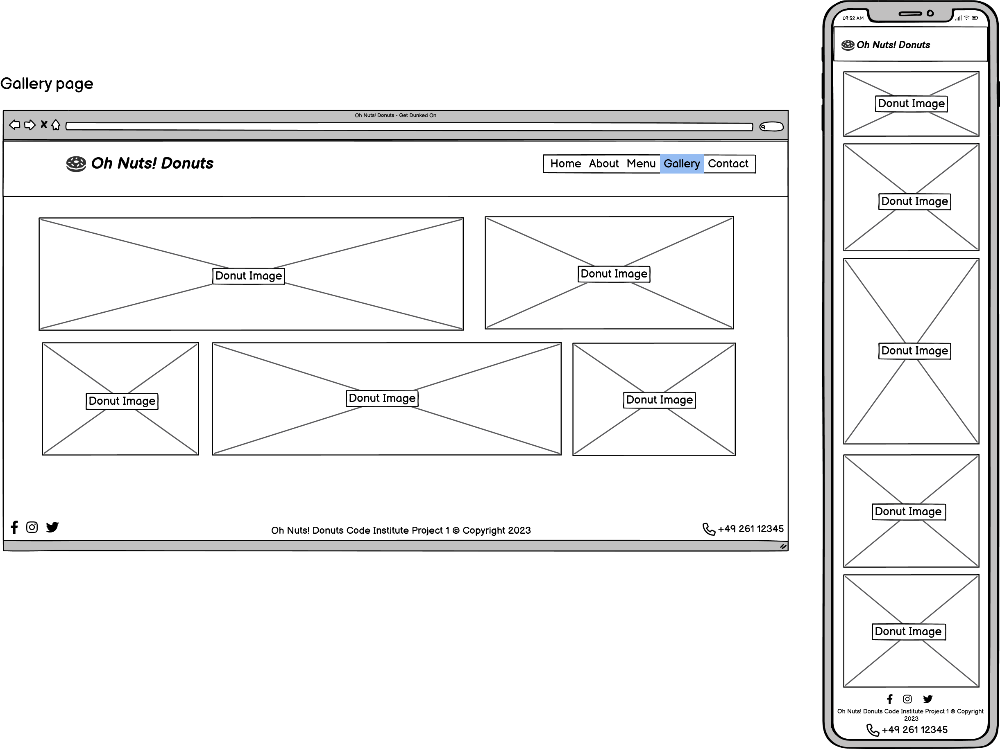
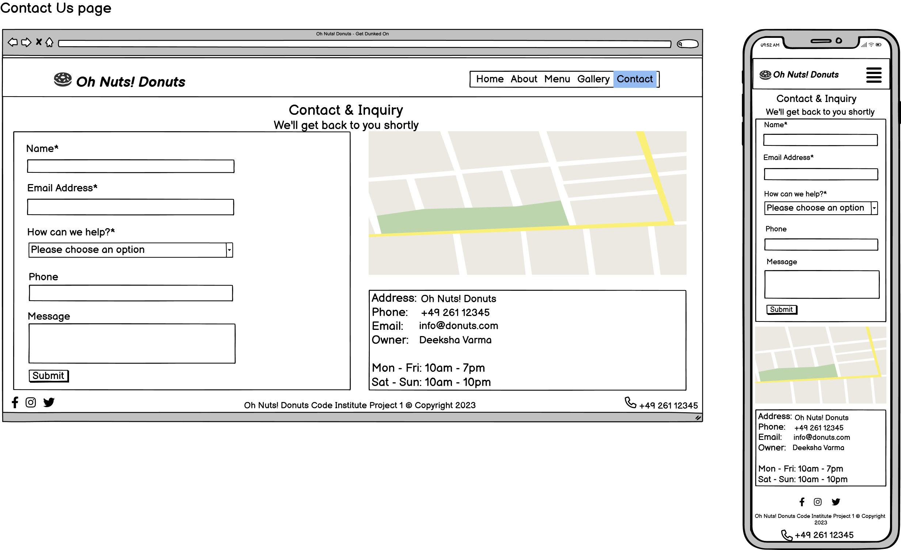

# Oh Nuts! Donuts
(Developer: Deeksha Varma)

## Table of Contents
1. [Introduction](#introduction)
2. [Project Goals](#project-goals)
    1. [User Goals](#user-goals)
    2. [Site Owner Goals](#site-owner-goals)
3. [User Experience](#user-experience)
    1.  [Strategy](#strategy)
        * [Target Audience](#target-audience)
        * [User Requirements & Expectations](#user-requirements-and-expectations)
        * [User Stories](#user-stories)
    2. [Scope](#scope)
        * [Initial Stage](#intial-stage)
        * [Future Additions](#future-additions)
    3. [Structure](#structure)
        * [Wireframes](#wireframes)
    4. [Skeleton](#skeleton)
    5. [Surface](#surface)
4. [Technologies Used](#technologies-used)
    1. [Language](#languages)
    2. [Frameworks & Tools](#frameworks--tools)
5. [Testing and Validation](#testing-and-validation)
    1. [HTML](#html-validation)
    2. [CSS](#css-validation)
    3. [Accessibility & Performance](#accessibility--performance)
    4. [Browser Compatability](#browser-compatability)
6. [Bugs](#bugs-fixes-and-outstanding-issues)
7. [Deployment & Development](#deployment--development)
8. [Credits](#credits)

## Introduction
Welcome to <b>Oh Nuts! Donuts</b>, your ultimate destination for heavenly treats and unforgettable flavors! We are thrilled to bring you a delightful assortment of artisanal donuts that will tantalize your taste buds and leave you craving for more.
The goal of the website is to provide the user with a seamless and delightful online experience.
The target audience are -
Donut Enthusiasts, Foodies and Culinary Adventurers, Families and Friends, Gift Shoppers and Event Planners. The Oh Nuts! Donuts website aims to cater to their needs, providing a delightful online platform to browse, customize, and order exceptional donuts with convenience and ease.

## Project Goals

### User Goals
* Discover and explore a wide variety of donut flavors and options.
* Easily navigate and find information about different donuts.
* Stay informed about special offers, promotions, and new flavors.
* Enjoy an engaging and visually appealing browsing experience.
* Receive prompt customer support if needed.
* Access the website seamlessly across various devices, including mobile phones and tablets.

### Site Owner Goals
* Increase online visibility and reach a wider audience.
* Foster customer engagement and interaction with the brand.
* Promote donut products.
* Increase sales and revenue for Oh Nuts! Donuts.
* Enhance brand perception and reputation.
* Provide customer support and address inquiries promptly.

## User Experience

### Strategy

#### Target Audience
- Donut Enthusiasts
- Foodies and Culinary Adventurers
- Families and Friends
- Gift Shoppers and Event Planners
- Kids

#### User Requirements and Expectations
- User-Friendly Design and Navigation
- Simple intuitive design that allows the user to initiate action
- Menu and Product Information - easy access to a comprehensive menu that showcases the variety of donuts
- Links work as expected
- Easy was to contact the business
- Location and Contact Information
- Social Media Integration
- Visually appealing responsive design
- Accessibility

#### User Stories

##### First-time User
As a first time user, I want to ...
1. ... easily navigate through the website and understand what are the treats being offered.
2. ... find more information about the history of the business and their core values.
3. ... expect a clear and intuitive navigation menu that allows me to explore the different categories of donuts.
4. ... enticing visuals and explore the gallery page.
5. ... find the contact information and location of the business.

##### Returning Users
As a returning user, I want to ...
1. ... easily provide feedback or share my experience.
2. ... find social media links to connect with the business.
3. ... find directions to the location of the business.

##### Site owner
As the site owner, I want users to ...
1. ... be able to explore the menu, place orders, and access information effortlessly, ensuring a positive and delightful browsing experience.
2. ... be enticed by the mouthwatering visuals and descriptions leading them to place orders and indulge in the deliciousness of Oh Nuts! Donuts.
2. ... provide feedback, share their experiences, and interact with the brand through social media integration fostering a loyal and engaged customer base.

### Scope

#### Intial Stage

1. Website Design and Navigation:
    The website should have a simple design with intuitive navigation, ensuring easy access to different sections and a seamless browsing experience.
2. About section:
    This section which will include information about the history of the business and it's core mission and values.
3. Menu and Product Presentation:
    The menu should be visually appealing, showcasing the variety of donuts and treats available, along with detailed descriptions and enticing images that capture the essence of each flavor.
4. Location Information and Contact Details:
    Users should easily find information about the physical locations of Oh Nuts! Donuts shops, including operating hours and contact details for inquiries or special requests.
5. Social Media Integration:
    The website should integrate with the company's social media accounts, allowing users to stay connected and informed about updates and events.

#### Future Additions
In future expansion the site could include
- Promotions and Special Offers
- Customer Reviews and Testimonials
- Allergen Information and Dietary Considerations
- Newsletters
- Special offers and promotions

### Structure

#### Wireframes

The structure of the initial site will include five pages:

1. **Home Page** with navigation features in a header and footer, a hero section containing the hero title/caption with a button allowing the user to explore the menu.

2. **About Page** giving a brief history of "where it all started" and the core mission of the business. This page will include the same header and footer as the main page.

3. **Menu Page** providing a beautiful column layout of the different kinds of donuts served. Each item on the catalogue is depicted with a donut image and their corresponding names and descriptions. The images provide interactivity on hover.

4. **Gallery Page** with a bunch of images that provides a visual appeal to the website.

5. **Contact Page** that contains 3 sections - a form that includes name, email, phone number, dropdown to select the reason for writing. There will be a field for a text message as well. The next section on the top right will be a map view of the business. Bottom right section will contain information on the address and operating hours of the business.

6. **Thank you Page** - a simple thank you page that displays thank you message to the user on contact form submission is also included.

7. **404 Page** - a simple 404 Error page is also included.

### Skeleton
How is it implemented. how will the user navigate it? Features.

### Surface
Colors, images

## Technologies Used

### Languages
* [HTML5](https://en.wikipedia.org/wiki/HTML) - Provides the content and structure for the website.
* [CSS3](https://en.wikipedia.org/wiki/CSS) - Provides the styling for the website.

### Frameworks & Tools
- [Git](https://git-scm.com/) - Version Control System used to track the project development.
- [Github](https://github.com/) - Used to host and edit the website.
- [Balsamiq](https://balsamiq.com/) - Used to create wireframes.
- [Google Fonts](https://fonts.google.com/) - Used to open source font-families for use in CSS.
- [Font Awesome](https://fontawesome.com/) - Used for adding icons to the website.
- [Coolors](https://coolors.co/contrast-checker/7c8edb-000000) - Color contrast checker of text and background colors.
- [Image Color Picker](https://imagecolorpicker.com/) - useful to pick colors from images.
- [I love Img](https://www.iloveimg.com/resize-image) - helps to resize images.
- [Am I Responsive](https://ui.dev/amiresponsive) - mockup generator that checks for responsiveness across various device screen widths.

## Testing and Validation

### HTML Validation
- HTML
  - [W3C validator](https://validator.w3.org/nu/?doc=https%3A%2F%2Fcode-institute-org.github.io%2Flove-running-2.0%2Findex.html)

### CSS Validation
- CSS
  - [(Jigsaw) validator](https://jigsaw.w3.org/css-validator/validator?uri=https%3A%2F%2Fvalidator.w3.org%2Fnu%2F%3Fdoc%3Dhttps%253A%252F%252Fcode-institute-org.github.io%252Flove-running-2.0%252Findex.html&profile=css3svg&usermedium=all&warning=1&vextwarning=&lang=en#css)

### Accessibility & Performance

### Browser Compatability

## Bugs, Fixes and Outstanding issues

## Deployment & Development

### **To deploy the project**
The site was deployed to GitHub pages. The steps to deploy a site are as follows:
  1. In the GitHub repository, navigate to the **Settings** tab.
  2. Once in Settings, navigate to the **Pages** tab on the left hand side.
  3. Under **Source**, select the branch to **master**, then click **save**.
  4. Once the master branch has been selected, the page will be automatically refreshed with a detailed ribbon display to indicate the successful deployment.

  The live link to the Github repository can be found here - add link here.

### **To fork the repository on GitHub**
A copy of the GitHub Repository can be made by forking the GitHub account. This copy can be viewed and changes can be made to the copy without affecting the original repository. Take the following steps to fork the repository;
1. Log in to **GitHub** and locate the [repository](https://github.com/deeksha-varma/portfolio_project_1).
2. On the right hand side of the page inline with the repository name is a button called **'Fork'**, click on the button to create a copy of the original repository in your GitHub Account.

### **To create a local clone of this project**
The method from cloning a project from GitHub is below:

1. Under the repository’s name, click on the **code** tab.
2. In the **Clone with HTTPS** section, click on the clipboard icon to copy the given URL.
3. In your IDE of choice, open **Git Bash**.
4. Change the current working directory to the location where you want the cloned directory to be made.
5. Type **git clone**, and then paste the URL copied from GitHub.
6. Press **enter** and the local clone will be created.

## Credits
### Content
* The font came from [Google Fonts](https://fonts.google.com/)
* The icons came from [Font Awesome](https://fontawesome.com/)

### Media
* The images came from [Pexels](https://www.pexels.com/)

## Acknowledgements
The site was developed as a part of a Full Stack Software Development Diploma Course at the [Code Institute](https://codeinstitute.net/) and is my Portfolio Project 1. I would like to thank my mentor [Mitko Bachvarov](https://www.linkedin.com/in/mitko-bachvarov-40b50776/), the Slack community, and all at the Code Institute for their help and support. This website has helped me feel so much confident when it comes to designing, building, testing and deploying a fully functioning website.

Deeksha Varma 2023.

