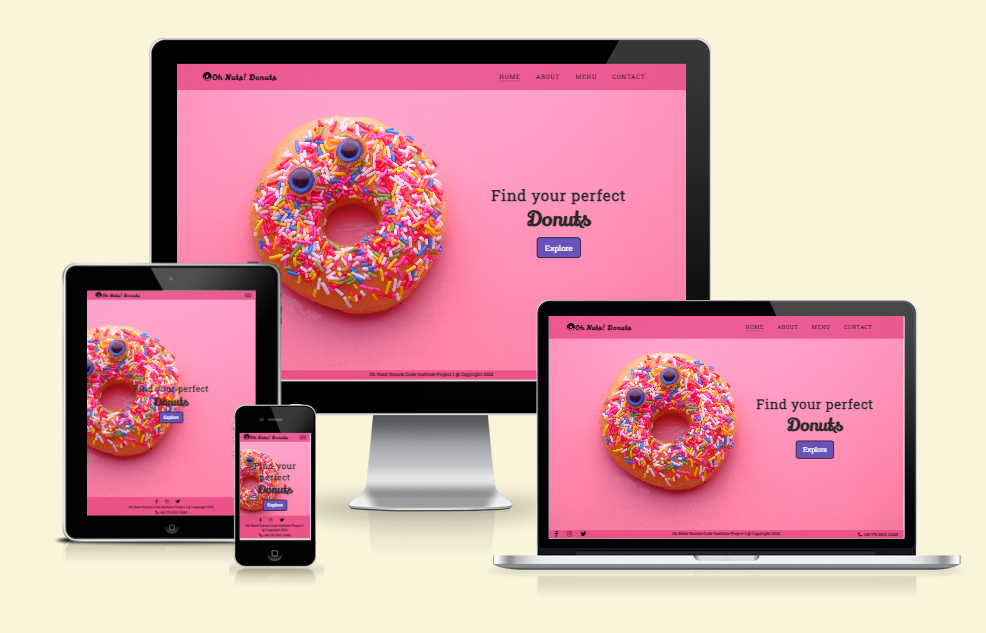
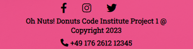
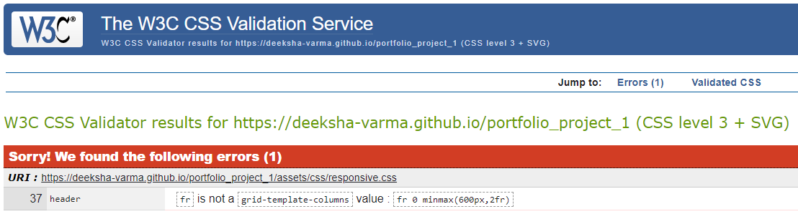

# Oh Nuts! Donuts
(Developer: Deeksha Varma)

You can view the live site here - <a href="https://deeksha-varma.github.io/portfolio_project_1/" target="_blank" rel="noopener">Oh Nuts! Donuts - Get Dunked On</a>

## Table of Contents
1. [Introduction](#introduction)
2. [Project Goals](#project-goals)
    1. [User Goals](#user-goals)
    2. [Site Owner Goals](#site-owner-goals)
3. [User Experience](#user-experience)
    1.  [Strategy](#strategy)
        * [Target Audience](#target-audience)
        * [User Requirements & Expectations](#user-requirements-and-expectations)
        * [User Stories](#user-stories)
    2. [Scope](#scope)
        * [Initial Stage](#intial-stage)
        * [Future Additions](#future-additions)
    3. [Structure](#structure)
        * [Wireframes](#wireframes)
    4. [Skeleton](#skeleton)
    5. [Surface](#surface)
        * [Color Scheme](#color-scheme)
        * [Font](#font)
4. [Technologies Used](#technologies-used)
    1. [Language](#languages)
    2. [Frameworks & Tools](#frameworks--tools)
5. [Testing and Validation](#testing-and-validation)
    1. [HTML](#html-validation)
    2. [CSS](#css-validation)
    3. [Accessibility & Performance](#accessibility--performance)
6. [Bugs](#bugs-fixes-and-outstanding-issues)
7. [Deployment & Development](#deployment--development)
8. [Credits](#credits)

## Introduction
Welcome to <b>Oh Nuts! Donuts</b>, your ultimate destination for heavenly treats and unforgettable flavors! We are thrilled to bring you a delightful assortment of artisanal donuts that will tantalize your taste buds and leave you craving for more.
The goal of the website is to provide the user with a seamless and delightful online experience.
The target audience are -
Donut Enthusiasts, Foodies and Culinary Adventurers, Families and Friends, Gift Shoppers and Event Planners. The Oh Nuts! Donuts website aims to cater to their needs, providing a delightful online platform to browse, customize, and order exceptional donuts with convenience and ease.

## Project Goals

### User Goals
* Discover and explore a wide variety of donut flavors and options.
* Easily navigate and find information about different donuts.
* Stay informed about special offers, promotions, and new flavors.
* Enjoy an engaging and visually appealing browsing experience.
* Receive prompt customer support if needed.
* Access the website seamlessly across various devices, including mobile phones and tablets.

### Site Owner Goals
* Increase online visibility and reach a wider audience.
* Foster customer engagement and interaction with the brand.
* Promote donut products.
* Increase sales and revenue for Oh Nuts! Donuts.
* Enhance brand perception and reputation.
* Provide customer support and address inquiries promptly.

## User Experience

### Strategy

#### Target Audience
- Donut Enthusiasts
- Foodies and Culinary Adventurers
- Families and Friends
- Gift Shoppers and Event Planners
- Kids

#### User Requirements and Expectations
- User-Friendly Design and Navigation
- Simple intuitive design that allows the user to initiate action
- Menu and Product Information - easy access to a comprehensive menu that showcases the variety of donuts
- Links work as expected
- Easy was to contact the business
- Location and Contact Information
- Social Media Integration
- Visually appealing responsive design
- Accessibility

#### User Stories

##### First-time User
As a first time user, I want to ...
1. ... easily navigate through the website and understand what are the treats being offered.
2. ... find more information about the history of the business and their core values.
3. ... expect a clear and intuitive navigation menu that allows me to explore the different categories of donuts.
4. ... find the contact information and location of the business.

##### Returning Users
As a returning user, I want to ...
1. ... easily provide feedback or share my experience.
2. ... find social media links to connect with the business.
3. ... find directions to the location of the business.

##### Site owner
As the site owner, I want users to ...
1. ... be able to explore the menu, place orders, and access information effortlessly, ensuring a positive and delightful browsing experience.
2. ... be enticed by the mouthwatering visuals and descriptions leading them to place orders and indulge in the deliciousness of Oh Nuts! Donuts.
2. ... provide feedback, share their experiences, and interact with the brand through social media integration fostering a loyal and engaged customer base.

### Scope

#### Intial Stage

1. Website Design and Navigation:
    The website should have a simple design with intuitive navigation, ensuring easy access to different sections and a seamless browsing experience.
2. About section:
    This section which will include information about the history of the business and it's core mission and values.
3. Menu and Product Presentation:
    The menu should be visually appealing, showcasing the variety of donuts and treats available, along with detailed descriptions and enticing images that capture the essence of each flavor.
4. Location Information and Contact Details:
    Users should easily find information about the physical locations of Oh Nuts! Donuts shops, including operating hours and contact details for inquiries or special requests.
5. Social Media Integration:
    The website should integrate with the company's social media accounts, allowing users to stay connected and informed about updates and events.

#### Future Additions
In future expansion the site could include
- Promotions and Special Offers
- Customer Reviews and Testimonials
- Allergen Information and Dietary Considerations
- Newsletters
- Special offers and promotions

### Structure

#### Wireframes

The structure of the initial site will include four pages:

1. **Home Page** with navigation features in a header and footer, a hero section containing the hero title/caption with a button allowing the user to explore the menu.

2. **About Page** giving a brief history of "where it all started" and the core mission of the business. This page will include the same header and footer as the main page.

3. **Menu Page** providing a beautiful column layout of the different kinds of donuts served. Each item on the catalogue is depicted with a donut image and their corresponding names and descriptions. The images provide interactivity on hover.

4. **Contact Page** that contains 3 sections - a form that includes name, email, phone number, dropdown to select the reason for writing. There will be a field for a text message as well. The next section on the top right will be a map view of the business. Bottom right section will contain information on the address and operating hours of the business.

5. **Thank you Page** - a simple thank you page that displays thank you message to the user on contact form submission is also included.

6. **404 Page** - a simple 404 Error page is also included.

### Skeleton

As described in the previous section with the aid of wireframes, the website includes six pages, which all have a consistent header and footer. The home page includes a call to action button, which links to the menu page.

#### Header

Screenshot of header on desktop

Screenshot of header on mobile

- Featured on all four main pages (also the Thank you page and 404 page).
- Includes the company name/logo and a menu with links to the Home page, About page, Menu page, Contact page.
- The header is fully responsive and changes to a hamburger menu on smaller screens.
- If a user hovers over a menu option in desktop mode an animated bar shows them which option they are choosing.

#### Footer

Screenshot of Footer on Desktop

Screenshot of footer on mobile

- Featured on all four main pages (also the Thank you page and 404 page).
- Includes links to the social media pages which the company maintains: Facebook,   Instragram, and Twitter.
- All links open in a new window.
- Includes Copyrights Reserved text.
- Includes Contact Number of the business.
- The footer is fully responsive and changes to fill three lines on smaller screens.

#### Home Page

Screenshot of Home page on Desktop

Screenshot of Home page on mobile

- Includes a hero image.
- A call to action button features on center of the hero image. It links to the menu page.

#### About Page

Screenshot of About page on Desktop

Screenshot of About page on mobile

- Features two images with information on the history of the business and their mission.
- The images have hover effect only in the Desktop view.

#### Menu Page

Screenshot of Menu page on Desktop

Screenshot of Menu page on mobile

- Features images with small description and price of each of the menu item in a column format.
- The images have hover effect on Desktop and tablet devices.

#### Contact Page

Screenshot of Contact page on Desktop

Screenshot of Contact page on mobile

- Features a contact form that a customer can submit to express concerns/provide feedback/request more information.
- Features an address info card with information about the business such as Address, Email ID of the business, Contact number, Owner info, Working hours.
- The address info card also features social media icons that link to the social media pages that the business uses such as Facebook, Instagram and Twitter. The icons have a hover effect.
- The map view of the business.

#### Thank you Page

Screenshot of Thank you page on Desktop

Screenshot of Thank you page on mobile

- The thank you page (or confirmation page) is used to thank users and confirm to them what they did was successful.
- This page is to notify users who submit the contact form that their action was successful and their data has been collected.
- Features a green tick mark icon to indicate success.
- Includes a button to allow the user to navigate back to home page.
- Includes the header and footer.

#### 404 Page

Screenshot of 404 page on Desktop

Screenshot of 404 page on mobile

- The 404 error page is used to inform the user that they have arrived at the wrong address and provides a button to the user to navigate back to home page.
- Features a gif that represents 404 error.
- Includes the header and footer.

#### Future Additions

Features that could be implemented in the future is a gallery page, newsletters, customer testimonials in the about page, allergen information on the menu.

### Surface

The design of the website focuses on depicting a _playful_ and _vibrant_ color theme.
The visual image of donut with sprinkles is used as part of the logo branding.
A background image of donut is used to grab visual attention of the user while also adding a touch of charm and playfulness to the design.
Call-to-action button on the home page is used to establish a visual hierarchy to guide users' attention towards important elements such as the Menu page.
A combination of playful and modern fonts that add personality to the design while ensuring readability were chosen.

#### Color Scheme

The color scheme chosen needs to evoke a sense of playfulness, warmth, and deliciousness. With this idea in mind, a combination of bright and vibrant colors were used to capture attention and reflect the fun and joyful nature of donut indulgence.
The highlight on the homepage is the hero image. A neutral base, such as a light cream is paired with a pop of hot pink on the other pages. This approach allows the colorful elements, like illustrations or images, to stand out while maintaining an overall clean and modern look.

#### Font

'Lily Script One' is the font used for logo (the business name), text in the main body of the site and lowerlevel headings use 'Roboto Slab' font.

1. **Roboto Slab** is a clean and modern serif font that provides excellent readability. It has a straightforward and professional appearance, making it suitable for body text and general content.

2. **Lily Script One** is a handwritten script font with a playful and whimsical feel. Its flowing and casual letterforms add a touch of personality and creativity to logos, or decorative elements. Therefore aligning well with the delightful and handmade nature of Oh Nuts! Donuts.

## Technologies Used

### Languages
* [HTML5](https://en.wikipedia.org/wiki/HTML) - Provides the content and structure for the website.
* [CSS3](https://en.wikipedia.org/wiki/CSS) - Provides the styling for the website.

### Frameworks & Tools
- [Git](https://git-scm.com/) - Version Control System used to track the project development.
- [Github](https://github.com/) - Used to host and edit the website.
- [Balsamiq](https://balsamiq.com/) - Used to create wireframes.
- [Google Fonts](https://fonts.google.com/) - Used to open source font-families for use in CSS.
- [Font Awesome](https://fontawesome.com/) - Used for adding icons to the website.
- [Coolors](https://coolors.co/contrast-checker/7c8edb-000000) - Color contrast checker of text and background colors.
- [Image Color Picker](https://imagecolorpicker.com/) - useful to pick colors from images.
- [I love Img](https://www.iloveimg.com/resize-image) - helps to resize images.
- [Am I Responsive](https://ui.dev/amiresponsive) - mockup generator that checks for responsiveness across various device screen widths.

## Testing and Validation

### Code Validation

* The website has been thoroughly tested. All the code has been validated via the [W3C HTML Validator](https://validator.w3.org/) and [W3C CSS Validator](https://jigsaw.w3.org/css-validator/). 2 minor errors were found on the pages - 404.html and thankyou.html. 1 error was found on the responsive.css page while running the css validator. These were fixed immediately and documented below.

### HTML Validation

### CSS Validation

## Accessibility & Performance

### Accessibility Testing

The website was put through [a11y](https://color.a11y.com/Contrast/) to further test the contrast and found no issues.   

### Lighthouse Testing

### Responsiveness Testing
* The responsive design tests were carried out manually with [Google Chrome DevTools](https://developer.chrome.com/docs/devtools/) and [Responsive Design Checker](https://www.responsivedesignchecker.com/).  

## Manual Testing

### Browser Compatability

## Bugs, Fixes and Outstanding issues

### HTML Validation

* After putting the website through [HTML Validation](https://validator.w3.org/), I was presented with the following common errors for the pages (404.html & thankyou.html):  

    

* The backslash was replaced with a forward slash on the href attribute. The button tag was not being used so the element was removed and the button class was applied directly to the anchor element, the validator then returned with no errors.  

    

### CSS Validation

* After running the website through [W3C CSS Validator](https://jigsaw.w3.org/css-validator/), I was presented with the following error:  

    

* The code was fixed with the correct values for the grid-template-columns and the validator then returned with no errors.  

    

## Deployment & Development

### **To deploy the project**
The site was deployed to GitHub pages. The steps to deploy a site are as follows:
  1. In the GitHub repository, navigate to the **Settings** tab.
  2. Once in Settings, navigate to the **Pages** tab on the left hand side.
  3. Under **Source**, select the branch to **master**, then click **save**.
  4. Once the master branch has been selected, the page will be automatically refreshed with a detailed ribbon display to indicate the successful deployment.

  The live link to the Github repository can be found here - add link here.

### **To fork the repository on GitHub**
A copy of the GitHub Repository can be made by forking the GitHub account. This copy can be viewed and changes can be made to the copy without affecting the original repository. Take the following steps to fork the repository;
1. Log in to **GitHub** and locate the [repository](https://github.com/deeksha-varma/portfolio_project_1).
2. On the right hand side of the page inline with the repository name is a button called **'Fork'**, click on the button to create a copy of the original repository in your GitHub Account.

### **To create a local clone of this project**
The method from cloning a project from GitHub is below:

1. Under the repository’s name, click on the **code** tab.
2. In the **Clone with HTTPS** section, click on the clipboard icon to copy the given URL.
3. In your IDE of choice, open **Git Bash**.
4. Change the current working directory to the location where you want the cloned directory to be made.
5. Type **git clone**, and then paste the URL copied from GitHub.
6. Press **enter** and the local clone will be created.

## Credits
### Content
* The font came from [Google Fonts](https://fonts.google.com/)
* The icons came from [Font Awesome](https://fontawesome.com/)
* The markdown syntax used to write README doc were referenced from [Git Hub Doc](https://docs.github.com/en/get-started/writing-on-github/getting-started-with-writing-and-formatting-on-github/basic-writing-and-formatting-syntax)
* The donut names on the menu page were based out of creativity and for some Google was used as reference.
* This README file was adapted from the projects - [Art School](https://github.com/URiem/art-school) and [Reflection](https://github.com/MikeR94/CI-Project-Portfolio-1)

### Media
* Hero Image taken by [Towfiqu barbhuiya](https://www.pexels.com/@towfiqu-barbhuiya-3440682/) from [Pexels](https://www.pexels.com/photo/doughnut-with-sprinkles-on-pink-background-11484111/)
* Donut logo icon were sourced from [Flaticon](https://www.flaticon.com/free-icon/donut_8813470?term=donut&page=1&position=18&origin=tag&related_id=8813470)
* About page images were sourced from [Pexels](https://www.pexels.com/photo/pink-doughnut-on-white-textile-4686960/) and [Pixabay](https://pixabay.com/photos/doughnuts-desserts-pastries-treats-1868573/)
* Menu page images were sourced from the following -
    * [Banana Pudding](https://www.pexels.com/photo/donut-with-yellow-icing-and-chocolate-sprinkles-on-ceramic-plate-10305916/), by [filllvlad](https://www.pexels.com/@fillvlad/)
    * [Chocolate Glam](https://www.pexels.com/photo/close-up-photo-of-donuts-2955820/), by [Nishant Aneja](https://www.pexels.com/@nishantaneja/)
    * [Devil's Chocolate](https://www.pexels.com/photo/delicious-chocolate-donuts-with-dried-berry-sprinkles-7474263/), by [Valeria Boltneva](https://www.pexels.com/@valeriya/)
    * [Why Nut](https://www.pexels.com/photo/glazed-doughnuts-near-chocolates-on-white-table-6941048/), by [Alena Shekhovtcova](https://www.pexels.com/@alena-shekhovtcova/)
    * [Pink Zebra](https://www.pexels.com/photo/close-up-of-a-red-and-white-donut-7034529/), by [Tima Miroshnichenko]((https://www.pexels.com/@tima-miroshnichenko/))
    * [Rainbow Wheel](https://www.pexels.com/photo/flatlay-shot-of-donut-7033650/), by [Tima Miroshnichenko](https://www.pexels.com/@tima-miroshnichenko/)
    * [Exotic Strawberry](https://pixabay.com/photos/donuts-pastries-kringel-cakes-4633030/), by [Alexas_Fotos](https://pixabay.com/users/alexas_fotos-686414/)
    * [Nut O' Bear](https://www.pexels.com/photo/person-holding-donut-179907/), by [THE 5TH](https://www.pexels.com/@the-5th-50003/)
    * [Holy Grail](https://pixabay.com/photos/donut-pastry-sweet-sugar-box-5331966/), by [dohnalovajane](https://pixabay.com/users/dohnalovajane-11160395/)
    * [Party Box](https://www.pexels.com/photo/white-and-pink-doughnut-on-white-box-4686958/), by [cottonbro studio](https://www.pexels.com/@cottonbro/)
    * [Mango Masti](https://pixabay.com/photos/donut-doughnut-snack-dessert-3665638/), by [NoName_13](https://pixabay.com/users/noname_13-2364555/)
    * [Donutella](https://pixabay.com/photos/donuts-donut-pastries-cute-643277/), by [congerdesign](https://pixabay.com/users/congerdesign-509903/)

### Code

* The website was inspired by the Love Running Walkthough project and some of the code from the walkthrough project was used and adapted.
* [W3Schools](https://www.w3schools.com/) was referred to for syntax lookups, form code and phone number validation.
* Responsive navigation for this project was implemented using Kevin Powell's video -
    [Create a responsive navigation nav with no JS](https://www.youtube.com/watch?v=8QKOaTYvYUA&ab_channel=KevinPowell)
* CSS flexbox implemented using [this](https://www.youtube.com/watch?v=tXIhdp5R7sc&ab_channel=freeCodeCamp.org) video from FreeCodeCamp.

## Acknowledgements
The site was developed as a part of a Full Stack Software Development Diploma Course at the [Code Institute](https://codeinstitute.net/) and is my first Portfolio Project.

I would like to thank -
* my mentor [Mitko Bachvarov](https://www.linkedin.com/in/mitko-bachvarov-40b50776/) for his timely availability, feedback, guidance and support.
* my cohort facilitator, Kay for pointing me in the right direction during the course of the project. Also providing me with resources to bridge the gaps in my learning.
* My husband and son, without their support this could not have been possible. Thanks to their feedback.

Building this website has been a great learning curve for me. From designing the wireframes to thinking about design choices and implementing the vision I had, I feel happy, confident and proud as a developer to have come this far.

Deeksha Varma 2023.

